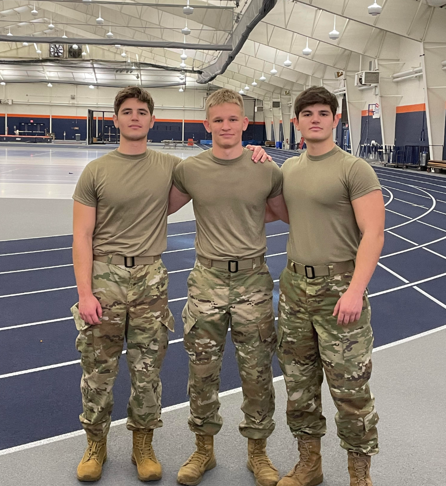

```{r setup, include=FALSE}
knitr::opts_chunk$set(echo = FALSE)
library(distill)
library(knitr)
library(ggplot2)
library(dplyr)
library(viridis)
```

{width=300px style="border-radius: 10px; margin-bottom: 20px"}

## About Me

**Martin Lorinkov**  
Cadet in Bucknell Army ROTC and Computer Science & Engineering major with a co-major in Data Science and minor in Russian.  
I'm passionate about systems programming, statistics, and applying machine learning to robotics and motorsport data.  

This site explores three major projects:  
- an interactive tool for understanding confidence intervals  
- a data story using Formula 1 telemetry  
- a virtual generative art exhibit

---

## Explore the Projects:

- [**Part 2:** Confidence Interval Explorer](Part2.html) — Interactive dashboard using `Shiny` and `Flexdashboard`
- [**Part 3:** Formula 1 Data Story](Part3.html) — Exploratory visualizations of racing strategy, execution, and performance
- [**Art Exhibit:** Generative Visual Art](Art.html) — Algorithmic art built with `aRtsy` and custom color palettes

---

## 🎨 Part 4: Virtual Exhibit 

This scroll-based exhibit blends data-driven storytelling and artistic expression. Below are snapshots previewing two core ideas explored in the full project.

### 📈 F1 Snapshot: Top Drivers by Points

```{r}
f1_example <- data.frame(
  Driver = c("Verstappen", "Hamilton", "Norris", "Leclerc"),
  Points = c(454, 275, 220, 198)
)

ggplot(f1_example, aes(x = reorder(Driver, Points), y = Points, fill = Points)) +
  geom_col() +
  scale_fill_viridis_c(option = "plasma") +
  coord_flip() +
  labs(title = "Driver Points Snapshot",
       x = "Driver", y = "Points") +
  theme_minimal()
```

### 🧮 CI Width Demo: Effect of Sample Size

```{r}
ci_data <- data.frame(
  n = seq(10, 100, 10)
) %>%
  mutate(width = 2 * 1.96 * 1 / sqrt(n))

ggplot(ci_data, aes(x = n, y = width)) +
  geom_line(color = "darkred", size = 1) +
  labs(title = "Confidence Interval Width by Sample Size",
       x = "Sample Size", y = "CI Width") +
  theme_minimal()
```

### 🔧 Palette Example

```{r fig.width=7, fig.height=1}
library(scales)
par(mar=c(1,1,1,1))
show_col(viridis_pal(option = "plasma")(8), labels = FALSE)
```

---
